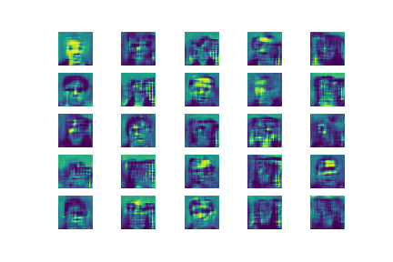
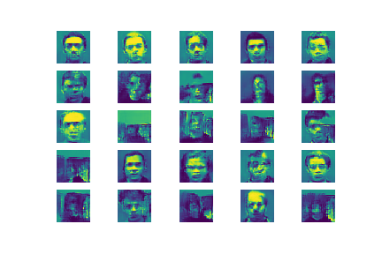
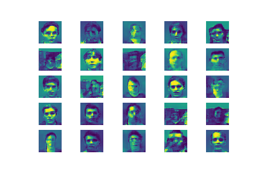
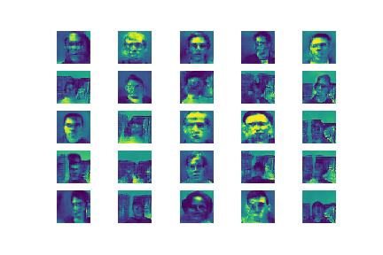
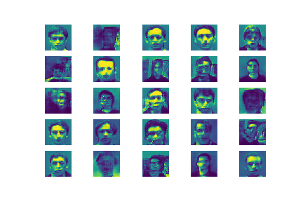

# DCGAN Using Faces Dataset

These images are generated using Colab with resolution 64x64. For higher resolution use AWS or Google Cloud compute.

* Epoch 1000.png

  

* Epoch 4000.png

  

* Epoch 6000.png

  

* Epoch 8000.png

  

* Epoch 9000.png

  