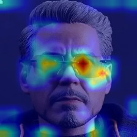
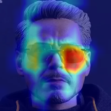
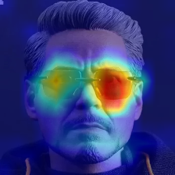

# Visualizations ( Kernel / Channel / GradCAM)

* [GradCAM using VGG16 network - Script](./GradCAM_Sunglasses.ipynb)

  

  * Input Image

    

    

  * GradCAM for layer block5_conv1

    

  * GradCAM for layer block5_conv2

    

  * GradCAM for layer block5_conv3 (closer to prediction)

    

    

     

