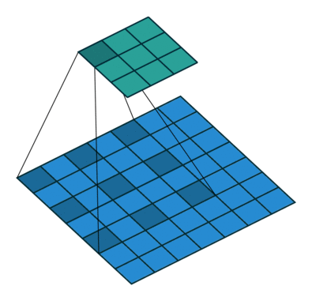
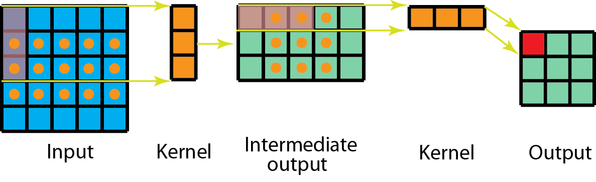

# Convolutions

[TOC]

* [Blog : Different kinds of Convolution - Animation](<https://towardsdatascience.com/a-comprehensive-introduction-to-different-types-of-convolutions-in-deep-learning-669281e58215>)

## 3x3 Convolution

* Input image: H x W x 3 (channels 3 - R, G, B)

* Apply Conv2D with 32 filters of size kernel size 3x3, with stride 1.

* Output: (H-2) x (W-2) x 32 

* Keras function:

  *Conv2D(32, (3,3), input=Input(28,28,3))*

  

## 1x1 Convolution - Pointwise Convolution

* Input size: HxWxD

* Apply 1x1 convolution of D filters

* Output: HxWx1

* Keras function:

  *Conv2D(128, (3,3)…)*

  *Conv2D(128, (1x1))*

* Advantages:

  * **Dimensionality reduction for efficient computation**.
  * Means, reduction in number of parameters
  * Pools the features
  * Can apply nonlinearilty after this convolution.
  * Used in Google **Inception network**

## Transpose Convolution 

This is also called **Fractionally Strided Convolution**.

The Transpose convolution is used for **up-sampling**. In the below picture,

the input 2x2 is up-sampled to 4x4. The transpose convolution are used in encoder-decoder network, where the input image is encoded as latent vectors and the decoder will recreate the input using the encoded vector. 

 

Keras function:

*Conv2DTranspose(32, (3,3))*

## Dilated Convolutions (Atrous Convolutions)

Dilated Convolutions are used when the network wants to learn the wider context (integrating the knowledge of global context)/ increase the receptive filed exponentially will less parameters.

Keras Function:

*Conv2D(32, (3,3), dilation_rate=(1,1) ) # is default regular convolution*

**Conv2D(32, (3,3), dialation_rate(2,2) )**

=> Dilated Conv., the pseudo kernel(inflated kernel) is of size (5,5) with empty rows and columns interleaved.

## Separable Convolution

The kernel is decomposed (split / breakup ) for the following reasons:

* to reduce the number of parameters and thus speed up the computation

* reduce overfitting.

  

#### Spatially Separable Convolution

*Spatially Separable Convolution decomposes the convolution into two separate operations*. For example, in the case of **3x3 conv**., it is separated into two conv operations with kernel **(3,1) and (1,3) ** convolution operations.

Standard Convolution:

Spatially Separable Convolution:

Keras Function:  

**No specific API**. But can be implemented like below.
Input image: 28x28x1

Instead of Conv2D(32, (3,3)) => Conv2D(32, (3,1)) followed by Conv2D(32,(1,3))

#### Depthwise Separable Convolution

In this case the convolution happens in *two steps:*

* Depthwise Convolution

  The kernel is separated for each input channel and applied convolutions.

* Pointwise Convolution

  Then apply 1x1 convolution to increase the volume.

*Keras funciton:*

**SperableConv2D(32, (3,3) )**

**SeparableConv2D() = DepthwiseConv2D() + Pointwise Convolution [Conv2D(filters, (1,1))]**

Note: **The Keras API names are little bit confusing**. Be careful while using those APIs.

## Grouped Convolution

The filters are grouped into different groups. Each group is responsible for traditional 2D convolutions with certain depth. **The main motivation is to reduce computational complexity.**

There is **no Keras API** for this.