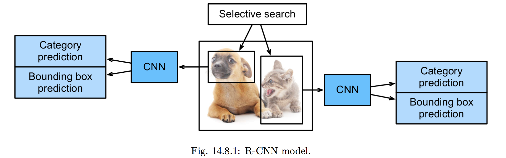
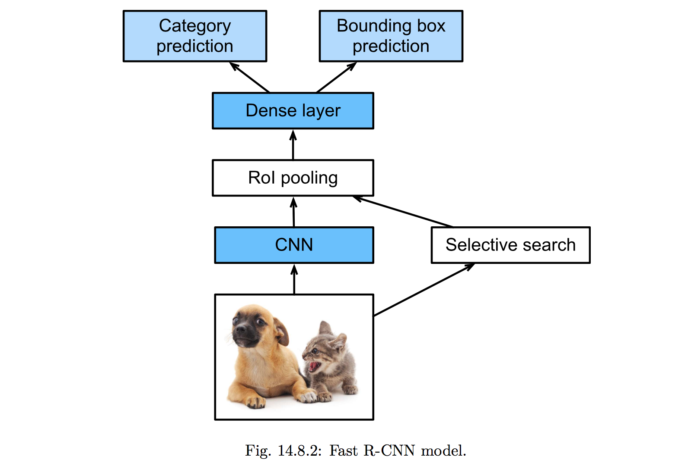
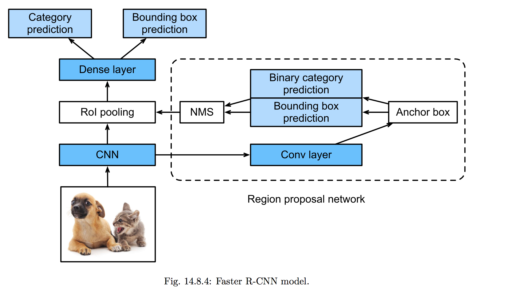
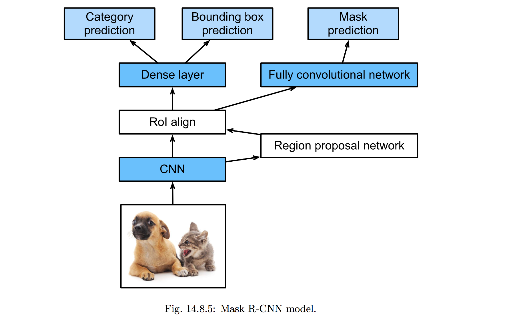

# Object Detection and Bounding Boxes

**Objective of these algorithms are not only to identify all the objects in image but also  their positions (bounding boxes).**

## Anchor Boxes

It's nothing but a bounding box.

### Generation of Multiple Anchor Boxes

Based on the *width* and *height* of the image and *aspect ratio (r)*, multiple anchor boxes can be generated for each pixel. The width and height of the each anchor box is determined based on image width, height and aspect ratio.

## IOU ( Intersection Over Union) [aka] Jaccard Index

The intersection over union measures the similarity between two set of images. This is also called as Jaccard index. The IOU ranges from 0 to 1. If IOU is zero then, there is no overlapping between two bounding boxes. If IOU is 1, it indicates, they are equal.

## Non Maximum Suppression

It means, pick the maximum from the set.

## Object Detection Model

* Single Shot Detection-Like-Approach
  * **Uses predefined set of bBoxes**
  * Single Shot Detection (SSD) Model
  * R-CNN (Region Based CNN)
    * Uses Selective Search + CNN over selected regions
  * Fast R-CNN
    * CNN + Selective Search => RoI (Region of Interest) Pooling
  * Faster R-CNN
    * CNN + Region Proposal Network (RPN) => RoI Pooling
  * Mask R-CNN
    * CNN + RPN => RoI Alignment
    * Category Prediction, BBox Prediction + Mask Prediction
* **YOLO (You Only Look Once)-Like**
  * **Uses K-means to extract bBoxes / Anchor boxes.**

## Selective Search for Object Detection (SSOR)

* [Paper: Selective Search for Object Detection](<https://ivi.fnwi.uva.nl/isis/publications/2013/UijlingsIJCV2013/UijlingsIJCV2013.pdf>)
* The Selective Search in turn depends on **[Efficient Graph-based Image Segmentation](<http://people.cs.uchicago.edu/~pff/papers/seg-ijcv.pdf>)** for the initial region proposals.

The **Selective Search** is used on the input image to select high quality proposed regions.

## R-CNNs

* Use Selective Search for the regions
* Use pre-trained CNN on the Selected search regions to classify the images in the region.

Downside:

 * Slow speed. The thousands of proposed regions from a single image requires thousands of forward computations thru CNN for object detection.

## Fast R-CNN

* Send the input image to CNN for **feature extraction**.

* The *Selective Search* generates n proposed regions. They are Regions of Interest (RoI).

* Uses RoI pooling: Extract the features from the proposed regions and concatenate them.

* Use FC to classify the image and position (bBox).

  

## Faster R-CNN

* Use **Region Proposal Network (RPN) ** instead of *Selective Search*.
* RPN
  * Uses 3x3 Conv to transform the CNN output and set the number of output channels.
  * Use  each element of feature map as center, generate multiple anchor boxes of different sizes and aspect ratios.
  * Predict the category and bBox.
  * Use Non Maximum Suppression (pick the max) to select the region as a proposal to RoI pooling layer.

## Mask R-CNN

* Similar to Faster R-CNN.
* Uses **RoI Alignment** instead of *RoI Pooling*, which outputs the feature map of same shape for all *RoI*s.
  * Which helps to locate objects at pixel level.