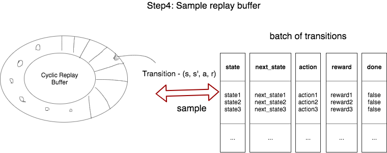
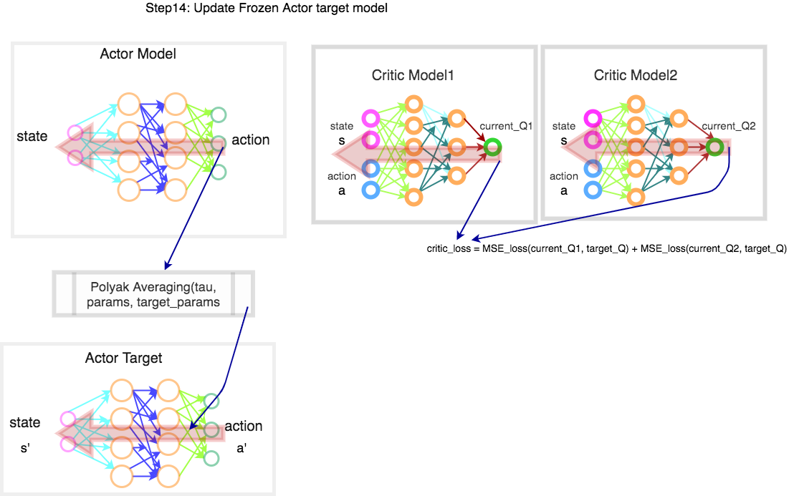

# T3D - Twin Delayed Deep Determistic Policy Gradient

[TOC]

---

* **Twin Delayed Deep Deterministic Policy Gradient**

  * **Policy** is the probability distribution of ***\*actions\**** for a given state.
    *  The **policy** is what agent controls. 
    * When the agent follows a policy, it generates a sequence of states, actions and rewards.  It called as **trajectory**.
  * **Policy Gradient**
    * The objective of the ***\*reinforcment learning agent\**** is to maximize the **(discounted) reward (from the start state)** when following the **policy**.
    * In ML setup, we define a set of parameters ($\theta$) to parmeterize the **policy**.
    * ​    The objective is to **maximize** the "expected" reward following a parameterize policy.
    * Atleast there will be one optimal policy which can give **maximum** reward. 
    * Among all optimal policies, atleast there will be one, which is ***\*stationary and deterministic\****.
    *  In ML, to maximize, we need to do ***\*Gradient Ascent\****.
  * **Deterministic Policy Gradient**
    * Learn a **deterministic action** for a given state.
    * Use ***\*Actor-Critic Model\****
  * **Deep Deterministic Policy Gradient (DDPG)**
    * The Actor and Critic are DNNs.

  * Architecutre:
    * For stability, we have ***\*Dual\**** (two) Network
      * Model- Model
      * Model- Target
    * Each Model is a **Duel** network.
      * Model- Actor
      * Uses Two Critics (thus, TWIN in the algo. name).
      * Model- Critic1 & Critic2 (Yes, two Critics/ Twin).
  * **Delayed**
    * The model - **Model** is updated at every step. But, the model - **target** is updated once every two steps. So, the name *delayed* in the algo.
  * **Twin**
    * Two critics instead of single critic in the Actor-Critic model.

    

---

## References

1. [Deterministic Policy Gradient Algorithms - David Silver](http://proceedings.mlr.press/v32/silver14.pdf)

2. [Drawing Done using Website draw.io](http://draw.io)

   

---

## T3D Implementation Flow

### Step1: Initialise Replay Buffer

### Step2: Build Actor DNN

### Step3: Build Critic Model

### T3D : Architecture

### Step4: Sample from Replay Buffer

### Step5: Find next_action using Actor Target

### Step6: Add Gaussian Noise and Clamp the value

### Step7: Find Q values using Critic Target Model

### Step8: Find Min of Two Target Critic Q-values

### Step9: Find Target Q-value

### Step10: Find Q values from Critic Models

### Step11: Find Critic Loss

### Step12: Back Propagate Critic Loss to Critic Models

### Step13: Perform the Delayed Update to Actor Model

### Step14: Update Frozen Actor Target Model

### Step15: Update Frozen Target Critics

